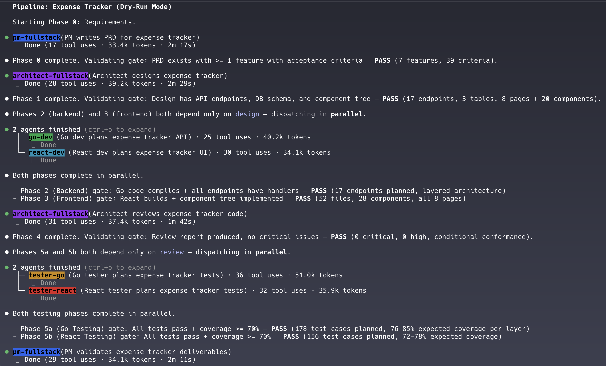

The Full Toolkit in Claude Code

Slash Commands (.claude/commands/\*.md)
These are just user-triggered prompts. You type /something, it injects a prompt template. Simple, static, no intelligence of their own. They're entry points, not agents.

Skills (SKILL.md)
Detailed instruction sets — like a playbook. They tell Claude how to do something complex. Still passive though — they're reference docs that get loaded into context.

Agents (subagents via the Task tool)
This is where the real power is. Claude Code can spawn independent sub-agents — separate Claude instances that run in parallel, each with their own context and instructions. An agent file (like agents/executor.md) defines a role, and the coordinator spawns it with Task(). These agents can work simultaneously on different parts of a problem.

MCP Servers
External tool integrations — give Claude access to APIs, databases, services. They extend what agents can do.

CLAUDE.md
The project-level system prompt. Sets the personality and default behavior for everything.

Run

```
claude code
```

Run for agent simulation

```
/el-capitan --dry-run "Build Expence tracker"
```

Run for real work

```
/el-capitan  "Build X"
```

```

  /el-capitan {request}
     ├─► Phase 0: pm-fullstack → PRD
     ├─► Phase 1: architect-fullstack → Design Doc
     ├─► Phase 2: go-dev → Go Backend
     ├─► Phase 3: react-dev → React Frontend
     ├─► Phase 4: architect-fullstack --review → Code Review
     ├─► Phase 5a: tester-go → Go Tests (parallel)
     ├─► Phase 5b: tester-react → React Tests (parallel)
     └─► Phase 6: pm-fullstack --review → Acceptance Review

```
